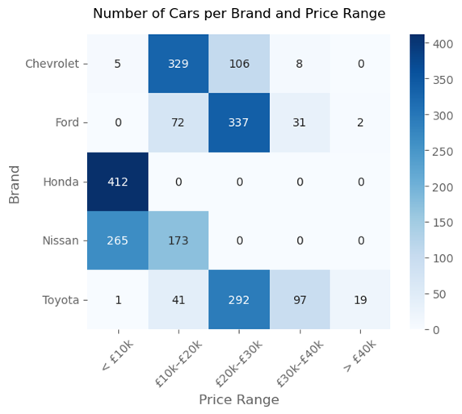

# Car Price Analysis

*Tools Used: Python (Jupiter Notebook), Power BI*

## Executive Summary

The problem is to accurately predict car prices based on a selected set of vehicle features (predictors). The challenge lies in choosing a manageable number of the most relevant and influential variables from a large pool of potential predictors, to build an effective and interpretable predictive model.

### Stakeholders:

| Stakeholder        | Interests                                                                                                                   |
|--------------------|------------------------------------------------------------------------------------------------------------------------------|
| Car Buyers         | They want to ensure they are paying a fair price for a vehicle based on its condition and features.                         |
| Car Dealers        | Price predictions allow dealers to set competitive prices, optimise inventory turnover, and offer personalised pricing strategies. |
| Used Car Platforms | Reliable pricing models increase user trust and engagement, driving platform growth and reputation.                         |

### Aim and Objectives:

To analyse listed cars and develop a model that predicts prices and segments vehicles for better customer recommendations.

**Objectives:**
- To explore the dataset and identify key features influencing car prices.
- To predict car prices using selected machine learning models.
- To segment cars based on specifications and price for targeted customer recommendations.
- To evaluate and interpret model performance for practical insights.

### Key Insights:

- **Price Range:** Majority of cars priced between `£5,000` and `£10,000`, with a significant portion in the `£10,000` to `£30,000` range. High-priced cars above `£30,000` are rare.

- **Brands:** `Toyota` and `Ford` dominate the mid-range market, while `Honda` and `Nissan` focus on lower price points (`Honda’s` cars are all under `£10,000`).

- **Car Age:** Most cars were manufactured between `2002` and `2013`, with fewer models from `2020–2022`.

- **Car Types:** `Hatchbacks` are the most common, followed by `SUVs` and `Saloons`. `Trucks` and `Coupes` are less frequent but have higher average prices.

- **Condition**: Most cars are in `Good` condition. `Excellent` condition cars command higher prices, and newer cars tend to be in better condition.

- **Fuel Types:** `Petrol` cars dominate the lower price range, while `Hybrid` and `Electric` vehicles are more common in the higher price ranges.

- **Mileage:** Higher mileage is linked to lower prices.

- **Key Price Determinants:** The main factors influencing car prices are the car's `manufacturing year`, `number of cylinders`, `engine size`, `estimated annual mileage`, `number of past owners`, `condition`, and `brand`. These elements provide critical insights for both pricing strategies and inventory management.

- **Price Prediction Model:** The Multilayer Perceptron (MLP) model is more accurate and advanced compared to the Linear Regression (LR) model. It delivers better overall performance in key metrics, providing more reliable price predictions with fewer errors. This makes it a stronger tool for pricing decisions and forecasting..

- **Car Segmentation:**

  - **Group 1 (Premium):** This group represents newer cars in better condition, typically with higher prices. These cars are generally Hybrid or Electric, attracting buyers looking for modern, environmentally-friendly vehicles.

  - **Group 2 (Budget):** This group includes older cars in poorer condition, with lower prices. These cars mostly feature traditional petrol engines, manual transmissions, and appeal to budget-conscious buyers seeking cost-effective options.

### Recommendations

- **Focus on Key Pricing Factors:** Leverage the most influential factors—such as `manufacturing year`, `engine size`, `mileage`, and `condition` when setting car prices. Tailoring prices based on these elements will enhance the precision of pricing models and lead to better customer satisfaction.

- *Enhance Customer Trust with Accurate Pricing:** By using advanced models like MLP to accurately predict prices, car dealerships and platforms can build trust with customers, ensuring that prices reflect fair value based on the car's condition, age, and features.

- **Target Premium and Budget Segments:**

  - For Group 1 (Premium) cars, focus on modern, high-condition vehicles with `Hybrid` or `Electric` engines. These vehicles attract eco-conscious buyers willing to pay higher prices.

  - For Group 2 (Budget) cars, prioritise pricing strategies that appeal to cost-conscious buyers, as these vehicles typically have lower prices, manual transmissions, and older features.

- **Adjust Inventory Strategy Based on Trends:** Given the demand for newer cars in better condition, dealerships should consider stocking more recent models, particularly those with `Hybrid` or `Electric` engines, to cater to the growing market for premium, eco-friendly vehicles.

## 1. Introduction

This project focuses on analysing car listings within the CW dataset to explore key trends that influence car prices. By examining various aspects of the data, the goal is to uncover patterns and insights that can support informed decision-making for car buyers, dealers, and platforms.

## 2. Data Understanding

The CW dataset offers comprehensive information on used cars listed for resale. In addition to car prices, it includes over `30` attributes ranging from model details to manufacturing year, insurance, and service history, to technical specifications such as transmission type, number of cylinders, and vehicle dimensions. 

**Dataset Type:** Cross-Sectional

**Dimensions:**
- Number of Rows (Observations): `2,230`
- Number of Columns (Features): `32`
- Data Types:
  - Numerical Features: `11` columns (e.g., `Price`, `Year`, `Owners`, `Warranty`, `carlength`, etc.)
  - Categorical Features: `21` columns (e.g., `Model`, `Fuel_Type`, `Transmission`, `Condition`, `Bluetooth`, etc.)

To simplify the analysis, eleven original predictors were selected. Additionally, two new variables, `Made` and `Body` are introduced. `Made` represents the car brand, derived from the original `Model` names, while `Body` refers to the car type, determined by the model’s name and the number of doors. This brings the total number of predictors to `12`.

According to Bergmann and Feuerriegel (2025), factors such as a car’s age, mileage, years of initial registration, model year, body type, engine specifications such as the horsepower, brand, and fuel type are among the most influential in determining the resale price of cars in their predictive model. Moreover, D'Allegro (2021) highlights the importance of car condition, emphasising that vehicles in better condition tend to fetch higher resale prices. Therefore, both external factors like the car's features and internal factors such as its condition are critical in accurately assessing a car’s value. 

| Name               | Type        | Role      | Detail                                                                 |
|--------------------|-------------|-----------|------------------------------------------------------------------------|
| Price              | Numeric     | Target    | Price of cars                                                          |
| Made               | Categorical | Predictor | Car Brand (5 Brands: Toyota, Ford, Nissan, Honda, Chevrolet)           |
| Body               | Categorical | Predictor | Car Type (5 Types: Hatchback, SUV, Saloon, Truck, Coupe)               |
| Year               | Numeric     | Predictor | The manufacturing year                                                 |
| Fuel_Type          | Categorical | Predictor | The type of fuel used (3 Types: Petrol, Hybrid, Electric)              |
| Transmission       | Categorical | Predictor | The type of transmission (2 Types: Manual or Automatic)                |
| Condition          | Categorical | Predictor | The overall condition of the car (3 Levels: Fair, Good, Excellent)     |
| Cylinder_Numbers   | Numeric     | Predictor | The number of cylinders in the car's engine                            |
| Engine_Size        | Numeric     | Predictor | The size of the car's engine                                           |
| Estimated_Mileage  | Numeric     | Predictor | Estimated annual mileage                                               |
| Warranty           | Numeric     | Predictor | Duration of the car's warranty (months)                                |
| peakrpm            | Numeric     | Predictor | Engine’s peak Revolutions per Minute (RPM)                             |
| Owners             | Numeric     | Predictor | The number of previous owners                                          |

## 3. Data Pre-processing and Feature Selection

To ensure the dataset is clean and reliable, missing values are handled, categorical labels are corrected, and numerical outliers are addressed. This is done using methods such as imputation, dropping records, and correcting data with additional information for analysis.

## 4. Exploratory Data Analysis (EDA)

### 4.1. The Distribution of Car Price

It is found that cars priced between `£5,000` and `£10,000` dominate the dataset, with over `600` records. Additionally, a significant number fall within the `£10,000` to `£30,000` range, while vehicles priced above `£30,000` are relatively scarce.

This suggests that the dataset primarily caters to budget and mid-range car buyers.

### 4.2. The Distribution of Manufacturing Year

The number of cars manufactured between `2002` and `2013` is the highest in the dataset. After `2013`, the count steadily declines, with fewer than `100` cars per year. 

Notably, the most recent years of `2020`, `2021`, and `2022` only have fewer than `50` cars each, indicating limited availability for newer vehicles.

### 4.2. Car Brand Analysis

The number of cars by brand is evenly distributed, all above `400`, with `Toyota` having the `highest` count at `450` and `Honda` the `lowest` at `412`.

In terms of pricing, `Toyota` shows the highest average price and the widest spread, indicating a broad range of options. Conversely, `Honda` has the lowest average price with minimal variation, suggesting limited offerings concentrated in the lower price range.

All `412` `Honda` cars are priced below `£10,000`, and all Nissan cars fall under `£20,000`. In contrast, `Toyota` and Ford dominate the `£20,000` to `£30,000` range, with `292` and `337` cars respectively, highlighting a mid-range market focus for these brands. 

### 4.3. Car Type Analysis

`Hatchbacks` are the most common type with `787` listings, followed by `SUVs` and `Saloons`. `Trucks` and `Coupes` have the lowest counts at `246` and `262`, respectively. 

This suggests that cars offering more seating or practicality are generally more popular among listed vehicles.

Trucks have the highest average price, with most of them are being sold from `£20,000` to `£30,000`, while `Saloons` display the widest price spread, with choices ranging from less than `£10,000` to `£40,000`. Most of `Hatchback’s` prices are from `£10,000` to `£30,000`.

### 4.4 Car Condition Analysis

Most of cars are in `Good` condition, with `62%`, their price ranges the widest, from under `£5,000` to over than `£45,000`, with an average of around `£17,000`. Cars in `Excellent` condition make up `25%`, showing highest average price of around `£26,000`, with a minimum near `£20,000`. 

### 4.5. Price Trends and Influencing Factors

Newer cars generally have higher prices due to several factors. These cars are usually in better physical and mechanical condition, have lower mileage, and come equipped with more up-to-date technology and safety features.

Conversely, newer vehicles tend to have lower annual miles driven compared to older models.

Vehicle condition also correlates strongly with age. The newer the car, the better its condition is likely to be. Newer models show a significantly higher proportion of listings in `Excellent` or `Good` condition.

In the lower price range, particularly under `£10,000`, `Petrol` cars are by far the most common. In contrast, Hybrid and Electric vehicles tend to dominate the higher price brackets, especially within the `£20,000` to `£30,000` range. 

When it comes to annual mileage, the overall trend is that the higher the miles driven, the lower the price.

Besides, most cars with mileage over `30,000 miles` driven are `Petrol` cars, while lower mileage cars, particularly under `20,000 miles`, are mostly `Electrics` and `Hybrids`.

## 5. Predictive Modelling

### 5.1. Linear Regression Model to Predict Car Price

Linear regression is a supervised learning method used to model the relationship between a dependent variable and one or more independent variables (Liu et al., 2024). In this scenario, it is applied to predict car prices based on several factors. By fitting a linear model to the data, the method uncovers the underlying pricing patterns and helps identify how different factors influence car prices.

**Data Partitioning:** `80%` for training, `20%` for testing.

**The Parsimonious Model:** The initial model, fitted with all available predictors, achieved an R² of `0.935`. After evaluating the significance of the predictors, `10 out of 19` with p-values below `0.05` were selected for the final model.

$$\text{Price} = -24.26 + 27.01 \times \text{Year} + 248.82 \times \text{Cylinder\_Numbers} + 1,158.34 \times \text{Engine\_Size} - 0.605 \times \text{Estimated\_Mileage} - 609.21 \times \text{Owners} + 489.15 \times \text{condition\_encode} - 2,512.73 \times \text{Made\_Chevrolet} - 1,388.82 \times \text{Made\_Ford} - 968.34 \times \text{Made\_Honda} - 1,933.32 \times \text{Made\_Nissan}$$

The most influential factors affecting car prices are:
- Car brand
- Car Condition
- Manufacturing Year
- Number of Cylinders
- Engine Size
- Estimated Annual Mileage
- Number of Past Owners

**The Model Performance:**

The parsimonious model demonstrates strong performance in predicting car prices, with high R² values indicating a good fit. MAE values suggest that the model is relatively accurate, with an average error of about `£1,600`.

| Metric                 | Training Set  | Test Set      |
|------------------------|---------------|---------------|
| R²                     | 0.9365        | 0.9277        |
| Mean Absolute Error    | 1,603.69      | 1,616.07      |
| Mean Squared Error     | 4,958,210.03  | 5,526,367.95  |

The model performs well overall but underpredicts prices for cars above `£40,000`. The predictions for higher-priced cars are consistently lower than actual values.

### 5.2. Neural Network Model to Predict Car Price

A Multilayer Perceptron (MLP), or Neural Network, is a supervised learning model used to predict outcomes from input features (Abu-Doush et al., 2023). It consists of multiple layers of neurons that learn complex patterns by adjusting weights during training. The model maps input features like car attributes, to a predicted price. Unlike Linear Regression, which assumes a straight-line relationship between input features and the target, MLPs can model non-linear relationships, making them more suitable for tasks where patterns are not purely linear (Zhou et al., 2023).

**Data Partitioning:** `80%` for training, `20%` for testing. To optimise model hyperparameters, the training set is further divided using `5-fold` cross-validation.

This cross-validation method helps find the best hyperparameters by evaluating the model on multiple training subsets. It provides a more reliable performance estimate and reduces overfitting, as each fold is used for both training and validation.

**The Best MLP Model:**
- Hidden Layers: 2 hidden layers, each with `50` neurons (`50`, `50`), enabling the model to capture complex patterns.
- Activation Function: ReLU (Rectified Linear Unit) to introduce non-linearity between layers.
- Regularisation (Alpha): L2 regularisation with an alpha value of 0.0001 to prevent overfitting and improve generalisation.

**Model Performance:**

The Best Model performs better than the Linear Regression with higher R². The Mean Absolute Error and Mean Squared Error for both Training and Test sets are substantially lower. Though still indicating some prediction errors, but overall, the model is effective.

| Metrics               | Training Set  | Test Set      |
|-----------------------|---------------|---------------|
| R²                    | 0.9629        | 0.9415        |
| Mean Absolute Error   | 1,158.54      | 1,445.87      |
| Mean Squared Error    | 2,900,484.07  | 4,470,115.76  |

Similar to the Linear Regression model, the MLP tends to underpredict prices for cars above `£40,000`, with predictions consistently lower than actual values, but it performs slightly better.

### 5.3. Model Comparisons and Conclusions

The MLP model outperforms the LR model in terms of R², MAE, and MSE, showing better overall accuracy and fewer prediction errors. The MLP also handles high-priced cars slightly better, with less underprediction compared to the LR model.

| Metric                         | Linear Regression (LR) | Multilayer Perceptron (MLP) |
|--------------------------------|------------------------|-----------------------------|
| R² (Training)                 | 0.9365                 | 0.9629 *                    |
| R² (Test)                     | 0.9277                 | 0.9415 *                    |
| MAE (Training)                | 1,603.69               | 1,158.54 *                  |
| MAE (Test)                    | 1,616.07               | 1,445.87 *                  |
| MSE (Training)                | 4,958,210.03           | 2,900,484.07 *             |
| MSE (Test)                    | 5,526,367.95           | 4,470,115.76 *             |
| High-Priced Cars Predictions  | Underpredicts above £40,000 | Less underpredictions * |

### 5.4. Error Cost Analysis

The MLP model is used to predict car prices due to its superior performance. However, the model still exhibits some errors, particularly for high-priced cars.

| Stakeholder         | Concerns                                                                                     | Worst Error                                                                                           |
|---------------------|----------------------------------------------------------------------------------------------|------------------------------------------------------------------------------------------------------|
| **Buyers**          | Car buyers want to pay a fair price based on the vehicle's condition and features. With an MAE of `£1,445`, especially for high-priced cars, buyers may end up overpaying or underpaying. | Underpredicting high-priced cars, leading to an average overpayment of `£1,445` for premium models.     |
| **Car Dealers**     | Dealers use price predictions to set competitive prices, manage inventory, and optimise strategies. Under-pricing high-value cars could result in lost profit, while overpricing may slow sales. | Underpredicting high-priced cars, leading to under-pricing premium vehicles and missed revenue opportunities. |
| **Used Car Platforms** | Reliable pricing models are crucial for building trust and engagement. Inaccurate predictions, particularly for high-priced cars, can decrease user confidence. | Underpredicting high-priced cars, making the platform seem less accurate in pricing premium vehicles, which could lower trust and engagement. |

## 6. Segmentation Analysis

In addition to predicting price, the unsupervised learning method of clustering is applied to group cars for enhancing customer recommendations based on similarity to their interests. 
Hierarchical Clustering is used here, which builds a tree-like structure of nested clusters. This method doesn't require specifying the number of clusters and provides a clearer understanding of car similarities for more accurate recommendations.

**Number of Clusters:** After evaluating the dendrogram below and considering the business needs, the optimal number of clusters is determined to be 2.

**Model Performance:** The Silhouette score is `0.6606`, indicating a good level of separation between the clusters. 

**Cluster Analysis:**

| Feature            | Cluster 1                                  | Cluster 2                              |
|--------------------|--------------------------------------------|----------------------------------------|
| Size               | 1313                                       | 877                                    |
| Price              | Higher (£23.2K Average)                    | Lower (£8.1K Average)                  |
| Year               | Newer (2012 Average)                       | Older (2005 Average)                   |
| Brand              | Evenly distributed, except Nissan (1%)     | Only Nissan and Honda                  |
| Condition          | Higher conditions                          | Lower conditions                       |
| Cylinders          | Higher (4 Average)                         | Lower (2.5 Average)                    |
| Annual Mileage     | Lower (15.1K miles Average)                | Higher (36.9K miles Average)          |
| Fuel Type          | Mostly Hybrid (55%) and Electric (33%)     | Mostly Petrol (95%)                    |
| Transmission Type  | Equally between Manual (53%) and Automatic (47%) | Mostly Manual (94%)                  |

**Conclusions:**
- **Cluster 1 (Premium):** This group consists of newer cars in better condition with higher prices. These vehicles are typically more modern, featuring Hybrid or Electric engines.
- **Cluster 2 (Budget):**  This group includes older cars in poorer condition with lower prices. These vehicles are generally traditional petrol engines, less advanced in terms of features, and mostly use manual transmission.

## 7. Conclusion & Recommendations

This analysis provides valuable insights into car listings, highlighting the key factors that influence car prices, including manufacturing year, number of cylinders, engine size, estimated annual mileage, number of past owners, car condition, and car brand. An advanced model was used to predict car prices with low error. Additionally, segmentation was applied to group cars into premium and budget categories, enhancing customer recommendations based on their preferences.

To improve performance, adding more details about the car's history, location, or usage could provide better insights into pricing. Trying more advanced techniques or adjusting the current model could also enhance predictions.

Future projects could focus on integrating real-time market trends and refining customer segmentation to offer more personalised recommendations. These improvements would make the model more relevant and reliable, benefiting both stakeholders and customers.

## References

- Abu-Doush, I., Ahmed, B., Awadallah, M.A., Al-Betar, M.A. and Rababaah, A.R., 2023. Enhancing multilayer perceptron neural network using archive-based Harris Hawks optimizer to predict gold prices. Journal of King Saud University - Computer and Information Sciences, 35(5), p.101557. doi: 10.1016/j.jksuci.2023.101557.

- Bergmann, S. & Feuerriegel, S., 2025. Machine learning for predicting used car resale prices using granular vehicle equipment information. Expert Systems with Applications, 263, p.125640. doi: 10.1016/j.eswa.2024.125640.

- D'Allegro, J., 2021. Just what factors value your used car? Investopedia. Available at: https://www.investopedia.com/articles/investing/090314/just-what-factors-value-your-used-car.asp [Accessed 3 April 2025].
  
- Liu, K., Wei, B., Chen, Y., Huang, Z. and Ma, W., 2024. Price prediction of power material procurement based on current linear regression model. Procedia Computer Science, 247, pp.290-299. doi: 10.1016/j.procs.2024.10.034.

- Zhou, Z., Qiu, C. and Zhang, Y., 2023. A comparative analysis of linear regression, neural networks and random forest regression for predicting air ozone employing soft sensor models. Scientific Reports, 13, p.22420. doi: 10.1038/s41598-023-49899-0.

